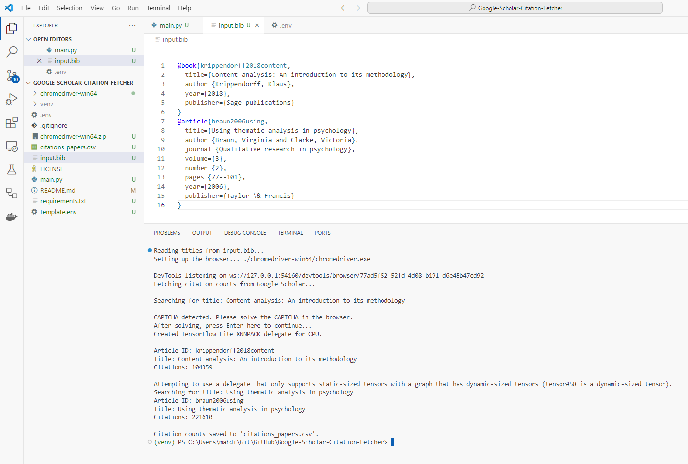

# Google Scholar Citation Fetcher

## Purpose
This app automates fetching citation counts for articles from Google Scholar. It reads article titles from a `.bib` file, searches Google Scholar for citations, and saves the results in a CSV file.

## Setting Up the Environment

### 1. Create a Local Environment
To ensure the app runs in an isolated environment:
```bash
python -m venv venv
source venv/bin/activate    # On Linux/Mac
venv\Scripts\activate       # On Windows
```

### 2. Install Requirements
Install the required Python libraries using `requirements.txt`:
```bash
pip install -r requirements.txt
```

### 3. Download ChromeDriver
Download the ChromeDriver for your Chrome browser version from [https://googlechromelabs.github.io/chrome-for-testing/](https://googlechromelabs.github.io/chrome-for-testing/).

Extract the Zip file and Place the downloaded `chromedriver.exe` in the path you want to specify in your `.env` file (e.g., `./chromedriver-win64/chromedriver.exe`).

### 4. Configure Environment Variables
Copy the `template.env` file to `.env`:
```bash
cp template.env .env
```

Update the `.env` file with the path to your ChromeDriver. For example:
```plaintext
CHROMEDRIVER_PATH=./chromedriver-win64/chromedriver.exe
```

## Running the App

Run the app using:
```bash
python main.py
```

The script:
1. Reads titles from `input.bib`.
2. Opens a browser, searches Google Scholar for each title, and retrieves the citation counts.
3. Saves the results to `citations_papers.csv`.

Note: You need to provide `input.bib` in the root of the project.

## Sample Execution



## Solving CAPTCHA
If Google Scholar detects automated activity, it may display a CAPTCHA. The app will pause and prompt:
```
CAPTCHA detected. Please solve the CAPTCHA in the browser.
After solving, press Enter here to continue...
```
Solve the CAPTCHA manually in the browser and press Enter in the terminal to resume.

## Expected Output
The app generates a `citations_papers.csv` file with columns:
- **Article ID**: Unique identifier from the `.bib` file.
- **Title**: Article title.
- **Citations**: Total citation count.

## Troubleshooting
1. Ensure the correct path to ChromeDriver is set in `.env`.
2. Use the latest version of ChromeDriver matching your Chrome browser.
3. Add delays (`time.sleep`) if Google Scholar blocks requests frequently.

